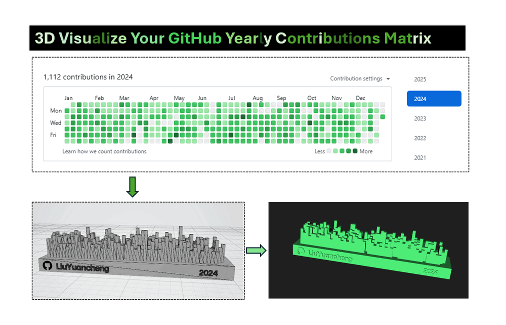
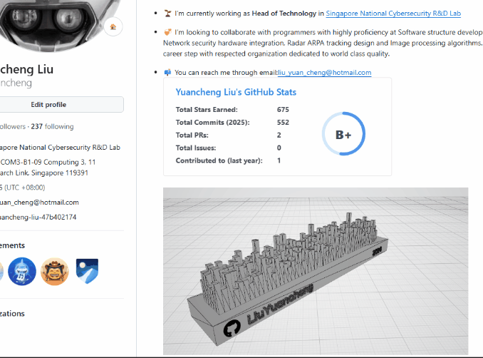
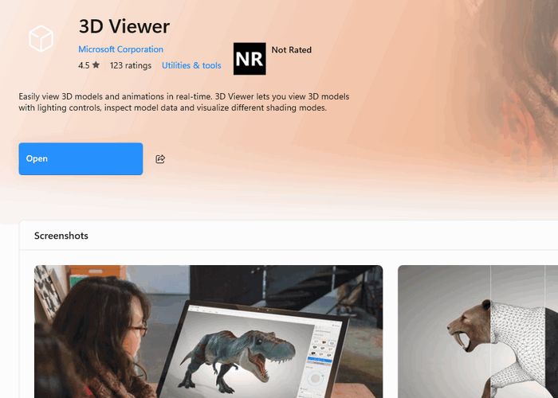
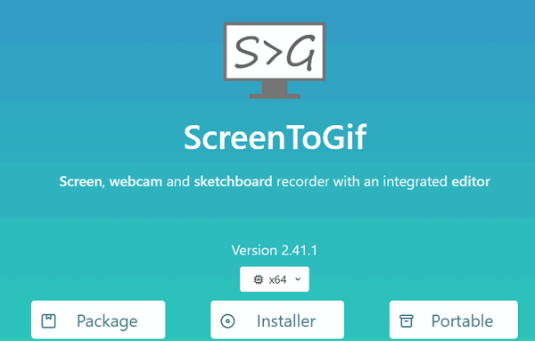
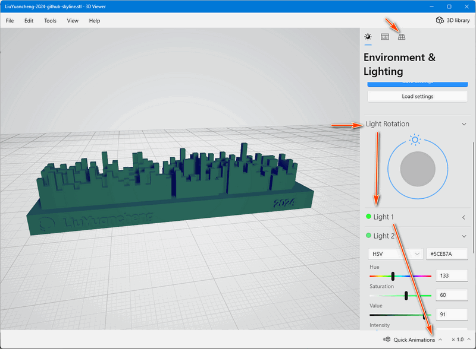
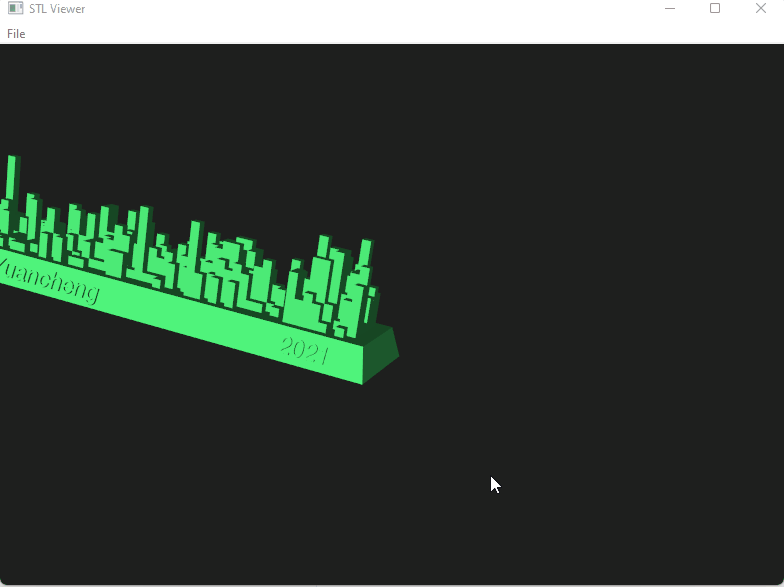

# 3D Visualize Your GitHub Yearly Contributions Matrix  



This article will introduce a very simple way to transform your yearly contributions matrix into a stunning 3D skyline visualization model. Then you can integrate it for your personal web, profile, readme, yearly summary or just a creative way to reflect on your coding journey. You can also use 3D printer to build a physical model by using the `stl` file. We will walk you through the steps to create a dynamic and shareable graphic, like this:

d

While there are several online tools available, this article focuses on building and customizing your visualizations locally using the following tools:

- GitHub Command Line Client
- gh-skyline 
- A visualization tool for 3D rendering
- A tool for generating GIF image


------

### Steps to Create a 3D Skyline Visualization of Your GitHub Contributions

As GitHub Skyline's web service is no longer available since last year, now we can not use their online service to create the contribution timeline as shown below image:


But we can set up and use the `gh-skyline` tool locally on your computer to create stunning 3D visualizations of your GitHub contribution matrix. Here's how you can do it step-by-step:

#### Install GitHub Command Line Client

Now the gh-skyline allow you to setup on you local computer, we need to install the GitHub command line tool first.

- Visit the [GitHub CLI installation guide](https://github.com/cli/cli#installation) to install the GitHub command line client on your system.

- After installation, log in by running:

  ```bash
  gh auth login
  ```

- Follow the prompts to authenticate with your GitHub account. For example, if you prefer use web to login, then select `Github.com` >  `Https` > `Authenticate Git with your GitHub credentials` > `Login with a web browser` , login with your  credentials when the browser pop-up and show GitHub sign in page  . 


- If you use the GitLab, select the "Other Host" and input the Gitlab IP/domain name.


#### Generate Skyline 3D STL File

- Use the GitHub CLI to install the `gh-skyline` extension:

```bash
gh extension install github/gh-skyline
```

- After finished the installation, Use the following command to create your 3D contribution skyline STL file (Replace `<GitHub Username>` with your actual GitHub username and adjust the year as needed.):


```bash
gh skyline --user <User name> --year 2023 --output my-skyline.stl
```


- You can also select the year range or generate "all". Once generated, the `my-skyline.stl` file will be available in the specified directory. 


#### Embed the STL File in Your Web Page

Now we got the 3D STL file, to integrate the file in your web, you need to upload a file to one of your public repo and get the URL. 

```http
https://github.com/YourUsername/YourRepo/blob/main/path/to/my-skyline.stl
```

For example, my STL URL is : https://github.com/LiuYuancheng/LiuYuancheng/blob/main/doc/skyline/LiuYuancheng-2024-github-skyline.stl

To convert the file URL to an embed script URL, we need to replace 2 part: 

- Replace `https://github.com` with `https://embed.github.com/view/3d/`.
- Remove `/blob/` from the URL.

```http
File URL:
https://github.com/LiuYuancheng/LiuYuancheng/blob/main/doc/skyline/LiuYuancheng-2024-github-skyline.stl
Embed URL:
https://embed.github.com/view/3d/LiuYuancheng/LiuYuancheng/main/doc/skyline/LiuYuancheng-2024-github-skyline.stl
```

Then we append the size parameters `?height=600&width=800` behind the embed URL and added as a script to put it in your web page:

```html
<script src="https://embed.github.com/view/3d/LiuYuancheng/LiuYuancheng/main/doc/skyline/LiuYuancheng-2024-github-skyline.stl?height=600&width=800"></script>
```

Here’s a simple Flask example to display your 3D skyline on a webpage:

```python
# A Simple flask example to integrate the github skyline stl file in a web page.
from flask import Flask
app = Flask(__name__)

# For example your github stl file is at:
#https://github.com/LiuYuancheng/LiuYuancheng/blob/main/doc/skyline/LiuYuancheng-2024-github-skyline.stl
# Then you need to change your embed URL to
stl_link = 'https://embed.github.com/view/3d/LiuYuancheng/LiuYuancheng/main/doc/skyline/LiuYuancheng-2024-github-skyline.stl'
# The size of the skyline 
module_size='?height=600&width=800'
stl_link += module_size

HTML_CONTENT = """<!doctype html>
<html>
    <head>
        <title> Web example to show the skyline stl file </title>
    </head>
    <body>
        <h1> Web example to show the skyline stl file </h1>
        <script src="%s"></script>
        <hr>
    <body>
</html>
""" %str(stl_link)

@app.route('/')
def index():
    return HTML_CONTENT

if __name__ == '__main__':
    app.run(host="0.0.0.0", port=5000, debug=False, threaded=True)
```

Link to download the python file: https://github.com/LiuYuancheng/LiuYuancheng/blob/main/doc/skyline/flaskStlTest.py

Run the Flask app and your 3D skyline will show as below:

 

If you want to integrate to file format not support script such as markdown file, one way is convert the stl file to a gif picture. we need to use some STL display tool, you can download the free stl viewer software from Microsoft App store.

 

- Download link: https://apps.microsoft.com/detail/9NBLGGH42THS?hl=en-us&gl=SG&ocid=pdpshare


To create the gif image, we use the free gif generation tool screentogif:



- Download link:  https://www.screentogif.com/


Open the stl file with the stl viewer and adjust the light rotation, add the grid, then change the color of your skyline matrix 3D model. as shown below:



After get the effect you want, select the quick animation then use the gif tool to record the view area to get a gif file:


Now you can add the gif picture file in your readme file. You can also create your own python STL display program as shown in this example: https://github.com/LiuYuancheng/LiuYuancheng/blob/main/doc/skyline/stlViewer.py




------

#### Reference

- https://cli.github.com/
- https://vtk.org/
- https://github.com/github/gh-skyline
-  https://docs.github.com/en/repositories/working-with-files/using-files/working-with-non-code-files


------

> Last edit by LiuYuancheng(liu_yuan_cheng@hotmail.com) at 26/01/2025, if you have any problem please free to message me.