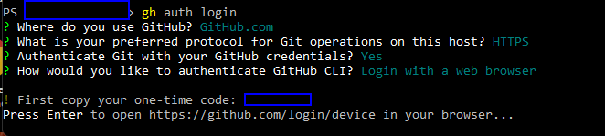
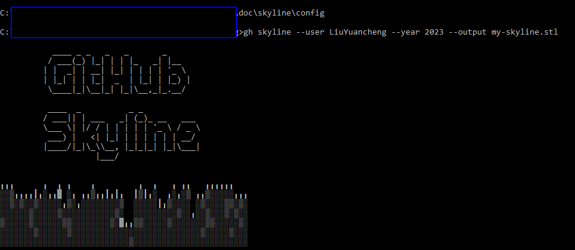
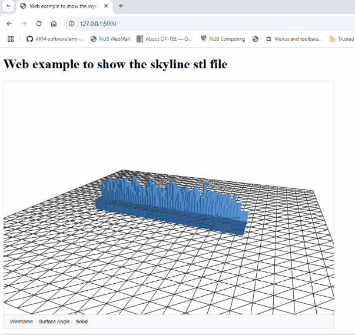

# 3D Visualize You GitHub Yearly Contribution Matrix  

This article will introduce a very simple way to convert your GitHub yearly contribution matrix to a 3D module and integrate in your social media such as profile. There are several web tools can do this, but if you want to do on your local computer these are the tools I used:

1. GitHub command line. 
2. gh-skyline
3. Some tls visualization tool 
4. Some gif picture generation tool. 

As the github skyline has stopped their web service last year, so we can not use their online service to create the contribution timeline as shown below image:


Now the gh-skyline allow you to setup on you local computer, we need to install the GitHub command line tool first. Follow this link to install the github command line client : https://github.com/cli/cli#installation

Then login with command: 

```
 gh auth login
```

Select the way you prefer to do the authorization, For me, I prefer to use the web to type in password, then select Github.com >  Https > Authenticate Git with your GitHub credentials > Login with a web browser, when the browser shows the Github, login with your credentials. 



Then we can use the GitHub command client to install the skyline with command 

```
gh extension install github/gh-skyline
```

After finished the installation, then we can use the below command to create your yearly contribution skyline stl file with command: 

```
gh skyline --user <User name> --year 2023 --output my-skyline.stl
```

You can also select the year range or generate all after execute the stl file my-skyline.stl will be created:



Now we got the 3D stl file, to integrate the file in your web, you need to upload a file to one of your public repo and get the url. For example my stl url is : https://github.com/LiuYuancheng/LiuYuancheng/blob/main/doc/skyline/LiuYuancheng-2024-github-skyline.stl

Now to build the embed url we need to replace the `https://github.com` in file url with the script embed url `https://embed.github.com/view/3d/` , then remove the `/blob/` to build the embed script URL. 

```
File URL:
https://github.com/LiuYuancheng/LiuYuancheng/blob/main/doc/skyline/LiuYuancheng-2024-github-skyline.stl
Embed URL:
https://embed.github.com/view/3d/LiuYuancheng/LiuYuancheng/main/doc/skyline/LiuYuancheng-2024-github-skyline.stl
```

Then we append the size parameters `?height=600&width=800` behind the embed URL and added as a script to put it in your web page:

```
<script src="https://embed.github.com/view/3d/LiuYuancheng/LiuYuancheng/main/doc/skyline/LiuYuancheng-2024-github-skyline.stl?height=600&width=800"></script>
```

Below is a example to integrate the stl in a flask web 

```python
# A Simple flask example to integrate the github skyline stl file in a web page.
from flask import Flask
app = Flask(__name__)

# For example your github stl file is at:
#https://github.com/LiuYuancheng/LiuYuancheng/blob/main/doc/skyline/LiuYuancheng-2024-github-skyline.stl
# Then you need to change your embed URL to
stl_link = 'https://embed.github.com/view/3d/LiuYuancheng/LiuYuancheng/main/doc/skyline/LiuYuancheng-2024-github-skyline.stl'
# The size of the skyline 
module_size='?height=600&width=800'
stl_link += module_size

HTML_CONTENT = """<!doctype html>
<html>
    <head>
        <title> Web example to show the skyline stl file </title>
    </head>
    <body>
        <h1> Web example to show the skyline stl file </h1>
        <script src="%s"></script>
        <hr>
    <body>
</html>
""" %str(stl_link)

@app.route('/')
def index():
    return HTML_CONTENT

if __name__ == '__main__':
    app.run(host="0.0.0.0", port=5000, debug=False, threaded=True)
```

Link to download the python file: 

When you run the program, your 3D skyline will show as below:

 


Reference: https://docs.github.com/en/repositories/working-with-files/using-files/working-with-non-code-files